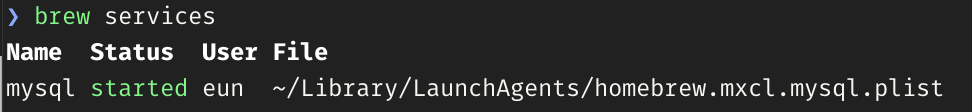
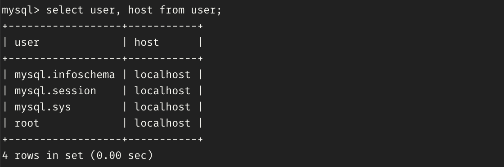
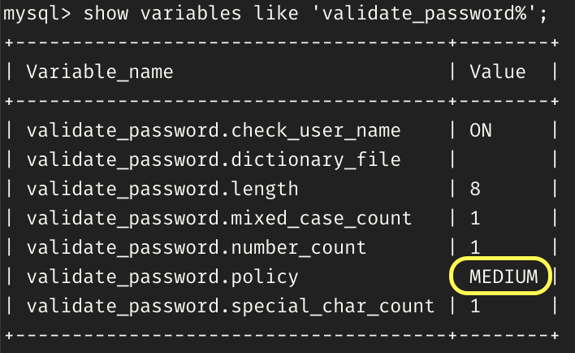
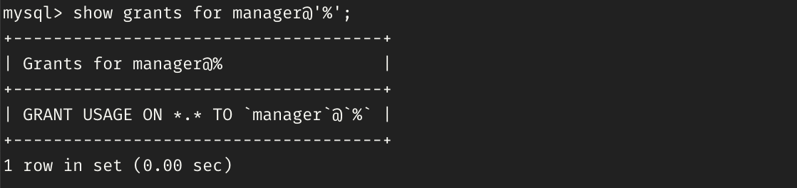

# ⚙️ 서버 실행 및 종료하기

### MySQL 서버 실행하기

```bash
mysql.server stop
```


### MySQL 서버 종료하기

```bash
mysql.server stop
```

### MySQL을 데몬으로 실행하기

```bash
brew services start mysql
```

### 서비스 재시작하기

```bash
brew services restart mysql
```

### 데몬으로 실행되고 있는 프로그램 목록 확인하기

```bash
brew services # 또는 brew services list
```



### 데몬 형태로 실행되고 있는 MySQL 종료하기

```bash
brew services stop mysql
```

<aside>
💡 데몬(daemon)이란?

멀티태스킹 운영체제에서 **데몬**(daemon)은 **사용자가 직접적으로 제어하지 않고**, 백그라운드에서 돌면서 여러 작업을 하는 프로그램을 말한다. 보통 데몬을 뜻하는 ‘d’를 이름 끝에 달고 있으며, 일반적으로 프로세스로 실행된다.

**사용자의 요청을 기다리고 있다가 요청이 발생하면 이에 적절히 대응**하는 리스너와 같은 역할을 한다. 즉, 메모리에 상주하면서 특정 요청이 오면 즉시 대응 할 수 있도록 대기중인 프로세스를 말한다.

</aside>

### MySQL 접속하기(로그인하기)

```bash
mysql -u 계정id -p - 접속할데이터베이스명

# 계정과 비밀번호 생성하지 않았을 때
mysql -u root

# root 비밀번호가 있을 때
mysql -u root -p
```

비밀번호를 입력하면 서버에 접속되고 terminal에 다음과 같이 표시된다.

```sql
mysql>
```

### 접속한 계정 확인하기

```sql
-- 현재 MySQL 사용자 표시
mysql> select user();
```

### 현재 MySQL 서버에 저장된 데이터베이스 목록 확인하기

```sql
mysql> show databases;
```

### MySQL 접속끊기(나가기)

```sql
mysql> exit
```

---

# 👤 사용자 계정 추가하기

### 사용자 목록 조회하기

사용자 목록은 mysql 기본 스키마인 `mysql` 안에 `user` 테이블에서 확인할 수 있다.

```sql
-- mysql 스키마 선택하기
mysql> use mysql;

-- select문을 통해 사용자 목록 조회하기
mysql> select user, host from user;
```



### 새로운 사용자(계정) 생성하기

사용자를 생성하는 권한은 기본적으로 `root` 에게 있다. 다음은 `root` 계정으로 접속하여 아이디가 `manager` 인 관리자 계정을 생성하는 명령어이다.

```sql
-- [주의] {username} @ localhost 이렇게 띄어쓰기하면 syntax error 발생
mysql> create user {username}@localhost identified by '{password}';
```

로컬에서 접근하기 위한 계정은 계정ID 뒤의 @에 `localhost`를 기재하면 되고 외부에서 접근하는 것은 그에 맞는 `ip주소`를 기재해주면 된다. 이 때 `'%'`를 적어주면 모든 외부접근을 허용할 수 있다.

### localhost만 추가된 계정에 외부 host 접근 권한 추가

```sql
-- 기존에 사용하던 계정ID와 동일한 계정으로 추가해준다.
mysql> create user {username}@'%' identified by '{password}';
```

### 사용자 제거하기

```sql
mysql> drop user {username}
-- 또는
mysql> drop user {username}@localhost;
```

---

## 🔑 password 정책 설정 변경하기

단순한 비밀번호를 사용하고자 할 때 password 정책 설정을 아래 단계로 변경해서 설정한다.

### 현재 비밀번호 정책 설정 확인하기

```sql
mysql> show variables like 'validate_password%';
```



validate_password_policy가 MEDIUM으로 설정되어 있다.

- validate_password.policy 단계
    - `LOW`: Length(최소 8자 이상)만 지켜주면 된다.
    - `MEDIEUM`: Lentgth + 숫자, 대문자, 소문자, 특수문자 모두 포함
    - `STRONG`: dictionary file을 등록하여 사용한다. 이 파일에 포함된 단어는 비밀번호로 사용할 수 없게 된다.

### validate_password.policy 설정 변경

```sql
mysql> set global validate_password.policy=LOW;
```

LOW로 설정한다.

```sql
mysql> show variables like 'validate_password%';
```

LOW로 잘 바뀌었는지 다시 확인해보자.

---

# 👑 계정 권한 부여하기

```sql
mysql> grant {권한} privileges on {스키마}.{테이블} to {username}@{ip};
```

### 모든 DB, 테이블 관리 모든 권한 부여

```sql
mysql> grant all privileges on *.* to {username}@{ip} with grant option;
```

- `all privileges on`은 SELECT(검색), INSERT(입력), UPDATE(수정), DELETE(삭제) 모든 권한을 포함한다.
- `on` 뒤에는 권한을 부여할 데이터베이스 객체를 명시한다.
- `*.*` 은 모든 데이터베이스의 모든 테이블 객체가 대상임을 의미한다.(univDB.student는 univDB 데이터베이스의 student 테이블 객체를 의미한다.)
- `with grant option` 은 부여받은 권한을 또 다른 사용자에게 부여할 수 있도록 허용한다는 의미이다.(GRANT를 사용할 수 있는 권한 추가)

### 특정 DB에만 모든 권한 부여

```sql
mysql> grant all privileges on {DBname}.* to {username}@localhost identified by '{password}';
```

### 외부 host에서 특정 DB를 관리할 수 있도록 SELECT, INSERT 권한 부여

```sql
mysql> grant select, insert on {DBname}.* to {username}@'%'
```

### 계정의 권한 확인하기

```sql
mysql> show grants for manager@'%';
```



`USAGE` 권한 지정자는 권한없음을 나타낸다. 권한은 없지만 MySQL에 계정이 있음을 알려주는 방식으로 사용된다.

### 권한 부여 내용 메모리에 반영하기

```sql
mysql> flush privileges;
```

### 권한이 잘 부여되었는지 확인하기

```sql
mysql> show grants for {usrname}@localhost;
```

---

# 💾 데이터베이스 생성

MySQL Workbench의 질의창에 다음과 같이 입력하여 `univDB` 실습 예제 데이터베이스를 생성해보자.

```sql
-- 데이터베이스 생성
DROP DATABASE IF EXISTS univDB;
CREATE DATABASE IF NOT EXISTS univDB;

-- SQL 명령어를 실행할 대상인 기본 데이터베이스를 univDB로 지정
USE univDB;

-- 학생 테이블 생성
CREATE TABLE 학생
	( 학번 CHAR(4) NOT NULL,
	  이름 VARCHAR(20) NOT NULL,
	  주소 VARCHAR(50) NULL DEFAULT '미정', 
	  학년 INT NOT NULL,
	  나이 INT NULL,
	  성별 CHAR(1) NOT NULL,
	  휴대폰번호 CHAR(14) NULL, 
          소속학과 VARCHAR(20) NULL,
	  PRIMARY KEY (학번), 
          CONSTRAINT CK_학생_1 CHECK (학년 >= 1 AND 학년 <= 4),  
	  UNIQUE (휴대폰번호) ) ; 

-- 과목 테이블 생성
CREATE TABLE 과목
	( 과목번호 char(4) NOT NULL PRIMARY KEY, 
	  이름 VARCHAR(20) NOT NULL, 
	  강의실 CHAR(3) NOT NULL,
	  개설학과 VARCHAR(20) NOT NULL,
	  시수 INT NOT NULL ) ; 
      
-- 수강 테이블 생성
CREATE TABLE 수강
	( 학번 char(6) NOT NULL,
	  과목번호 CHAR(4) NOT NULL,
	  신청날짜 DATE NOT NULL,
	  중간성적 INT NULL DEFAULT 0,
	  기말성적 INT NULL DEFAULT 0, 
	  평가학점 CHAR(1) NULL,        
	  PRIMARY KEY(학번, 과목번호), 
	  FOREIGN KEY(학번) REFERENCES 학생(학번) 
		ON UPDATE CASCADE ON DELETE CASCADE, 
	  FOREIGN KEY(과목번호) REFERENCES 과목(과목번호) 
		ON UPDATE CASCADE ON DELETE CASCADE,
	  CHECK (평가학점 IN ('A', 'B', 'C', 'D', 'F')) ); 

-- 학생 테이블 입력
INSERT INTO 학생
VALUES ('s001', '김연아', '서울 서초', 4, 23, '여', '010-1111-2222', '컴퓨터') ;
INSERT INTO 학생(학번, 이름, 주소, 학년, 나이, 성별, 휴대폰번호, 소속학과)
VALUES ('s002', '홍길동', DEFAULT, 1, 26, '남', NULL , '통계') ;
INSERT INTO 학생(학년, 나이, 성별, 소속학과, 학번, 이름)
VALUES (3, 30, '남', '정보통신', 's003', '이승엽') ;
INSERT INTO 학생
VALUES ('s004', '이영애', '경기 분당', 2, NULL, '여', '010-4444-5555', '정보통신') ;
INSERT INTO 학생
VALUES ('s005', '송윤아', '경기 분당', 4, 23, '여', '010-6666-7777', '컴퓨터') ;
INSERT INTO 학생
VALUES ('s006', '홍길동', '서울 종로', 2, 26, '남', '010-8888-9999', '컴퓨터') ;
INSERT INTO 학생
VALUES ('s007', '이은진', '경기 과천', 1, 23, '여', '010-2222-3333', '경영') ;

-- 과목 테이블 입력
INSERT INTO 과목
VALUES ('c001', '데이터베이스', 126, '컴퓨터', 3) ;
INSERT INTO 과목
VALUES ('c002', '정보보호', 137, '정보통신', 3) ;
INSERT INTO 과목
VALUES ('c003', '모바일웹', 128, '컴퓨터', 3) ;
INSERT INTO 과목
VALUES ('c004', '철학개론', 117, '철학', 2) ;
INSERT INTO 과목
VALUES ('c005', '전공글쓰기', 120, '교양학부', 1) ;

-- 수강 테이블 입력

INSERT INTO 수강
VALUES ('s001', 'c002', '2019-09-03', 93, 98, 'A') ;
INSERT INTO 수강
VALUES ('s004', 'c005', '2019-03-03', 72, 78, 'C') ;
INSERT INTO 수강
VALUES ('s003', 'c002', '2017-09-06', 85, 82, 'B') ;
INSERT INTO 수강
VALUES ('s002', 'c001', '2018-03-10', 31, 50, 'F') ;
INSERT INTO 수강
VALUES ('s001', 'c004', '2019-03-05', 82, 89, 'B') ;
INSERT INTO 수강
VALUES ('s004', 'c003', '2020-09-03', 91, 94, 'A') ;
INSERT INTO 수강
VALUES ('s001', 'c005', '2020-09-03', 74, 79, 'C') ;
INSERT INTO 수강
VALUES ('s003', 'c001', '2019-03-03', 81, 82, 'B') ;
INSERT INTO 수강
VALUES ('s004', 'c002', '2018-03-05', 92, 95, 'A') ;
```

### 데이터베이스 생성 확인

```sql
USE univDB; -- 작업 대상 데이터베이스 변경
SELECT database(); -- 현재 사용 데이터베이스 확인
SHOW TABLES; -- univDB 안의 생성 테이블 목록 확인
DESC 학생; -- 학생 테이블 생성 정보 확인
```

- USE 명령어 다음에 데이터베이스 이름을 지정함으로써 해당 데이터베이스로 작업 영역을 변경할 수 있다. 특히, 워크벤치를 새로 시작하는 경우, 반드시 작업 대상 데이터베이스를 먼저 지정해야 한다.