# R 기초 사용법

## R Studio

- **Console**
    - 실행 결과를 보여주는 역할
    - 스크립트 창을 띄워서 사용하는 것을 권장
    - 스크립트 창에서 실행시킨 것들의 결과 확인
- **Script(소스 편집기)**
    - 코딩 작업하는 곳
- **작업영역&이력**
    - 변수설정 내용이나 어떤 데이터를 이용했는지 정리
    - History 부분은 스크립트 창에 기록된 것들이 간략하게 나타남
- 파일탐색기, 플롯, 패키지, 도움말
    - 플롯: 그래프 혹은 패키지를 통해 출력시킨 것들 중 도표로 출력되는 내용 정리

---

## R 기초

주석은 `#` 사용

### R에서 제공하는 수학 함수의 종류

- sin(x), cos(x), tan(x), asin(x)
- log(x), log10(x), log2(x)
- exp(x)
- sqrt(x) - 루트계산
- trunc(x) - 소수점 이하를 버림

### R에서 지원하는 연산자의 종류

- +, -, *, /
- % / % (나눗셈의 몫)
- %% (나눗셈의 나머지)
- ** (제곱)

### R에서 변수 정의&사용하기

- `ls()` : 현재 사용 중인 변수의 목록을 보여줌
- `rm(list=ls())` : 현재 로드된 R에 선언된 모든 변수를 지움
- `rm(변수)` : 특정 변수 지움
- `변수이름 <- 값`  또는 `변수이름 = 값` : 변수 정의
- `(변수이름 ← 값)` 처럼 변수를 정의함과 동시에 소괄호 `( )` 로 묶어주면 변수 출력도 동시에 된다.
- `cat()` : 괄호 안의 내용을 화면에 출력
- `setwd("디렉토리 경로")` : working directory 설정
- `getwd()` : 현재 설정된 working directory 경로를 보여줌

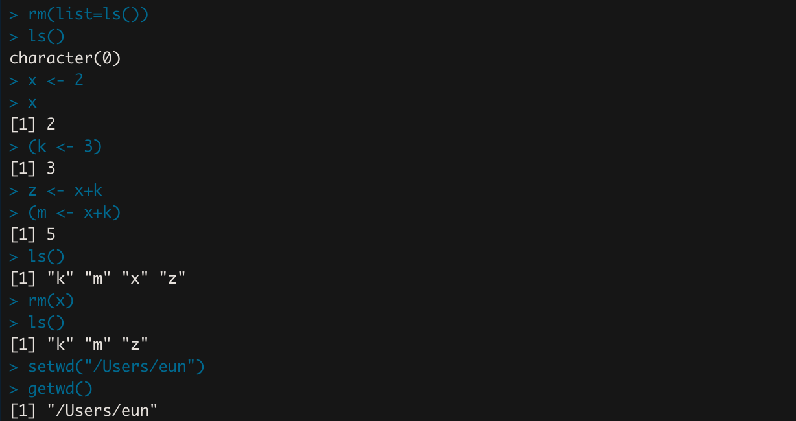

### 데이터 세트 사용하기

- `head(데이터셋)` : 첫 6행을 보여줌
- `tail(데이터셋)` : 마지막 6행을 보여줌
    
    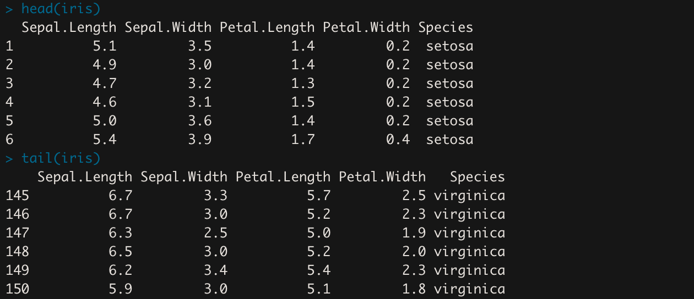
    
- `View(데이터셋)` : 데이터 내용을 테이블 형태로 보여줌(주의할 점: View의 V는 대문자로 쓸 것)
    
    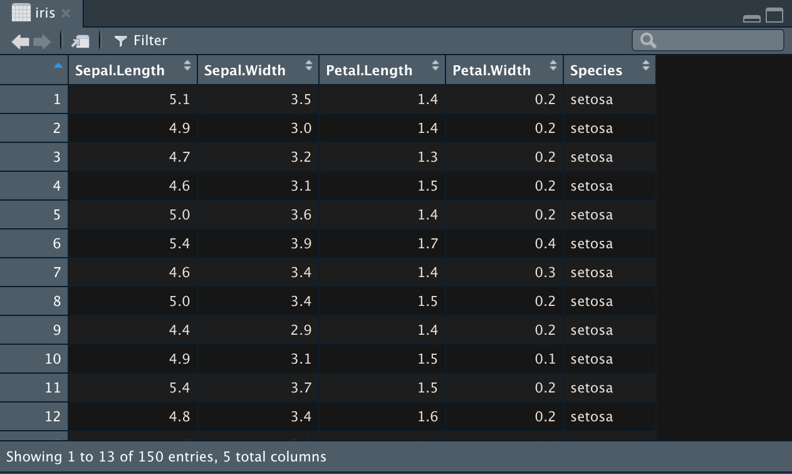
    
- `summary(데이터셋)` : 기본 통계량을 보여줌
    
    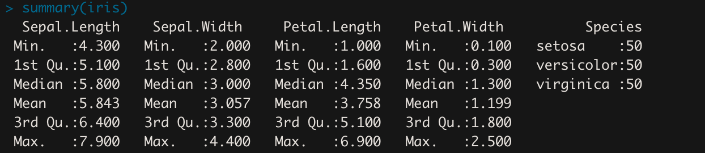
    
- `data(데이터셋)` : 해당 데이터를 사용하겠다는 선언
- `str(데이터셋)` : 데이터 구성을 보여줌(str은 structure를 의미함)
    
    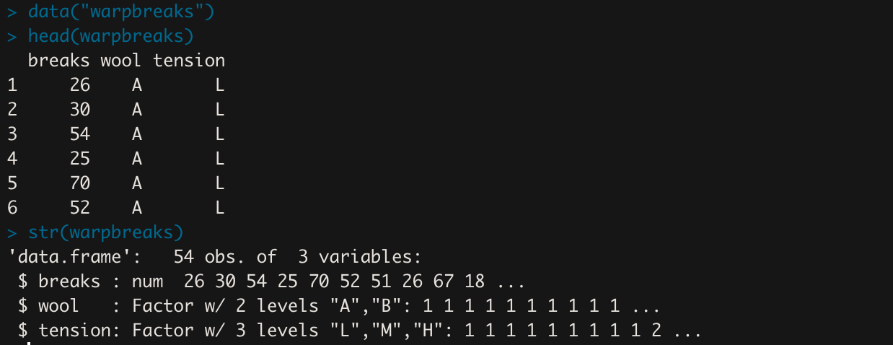
    
    - warpbreaks 데이터셋은 `data.frame` 형태이고, 54개의 행과 3개의 변수로 이루어짐
    - 변수 breaks는 num 타입이고 26, 30, 54, ... 값이 존재함
    - 변수 wool은 Factor 타입이고 2개의 단계 “A”, “B”가 존재함.
- `attach(데이터셋)` : 데이터를 고정으로 사용하겠다는 의미(detach 전까지 유효함)
- `detach(데이터셋)` : 해당 데이터를 메모리에서 지움
    
    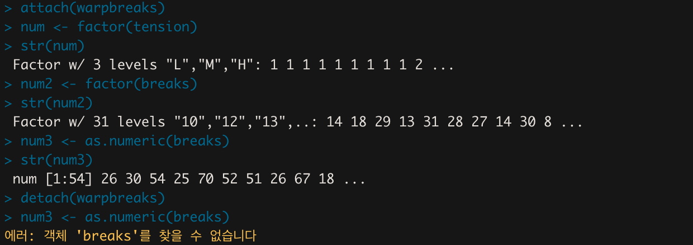
    
    - `num2 <- factor(tension)` : 변수 tension을 factor 타입으로 변환해서 변수 num에 할당함
    - `num3 <- as.numeric(breaks)` : 변수 breaks를 숫자 타입으로 변환해서 변수 num3에 할당함
    - `detach` 후에는 메모리가 지워졌기 때문에 해당 데이터셋의 변수도 같이 지워진다.

### 데이터를 파일에 저장하고 읽어오기

- `save(변수, file="파일명.Rdata")` : 변수값을 파일로 저장한다(setwd에 설정된 워킹디렉토리 위치에 파일이 저장된다)
- `load("파일이름")` : (워킹디렉토리 위치에서) 파일 내용을 읽어온다.
    
    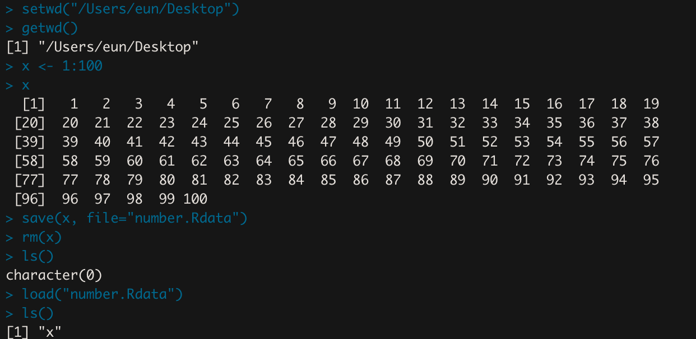
    
- `write.csv(변수, file="파일이름")` : 변수 데이터를 csv 파일로 저장
- `resd.csv("파일이름")` : csv 파일을 읽어옴
    
    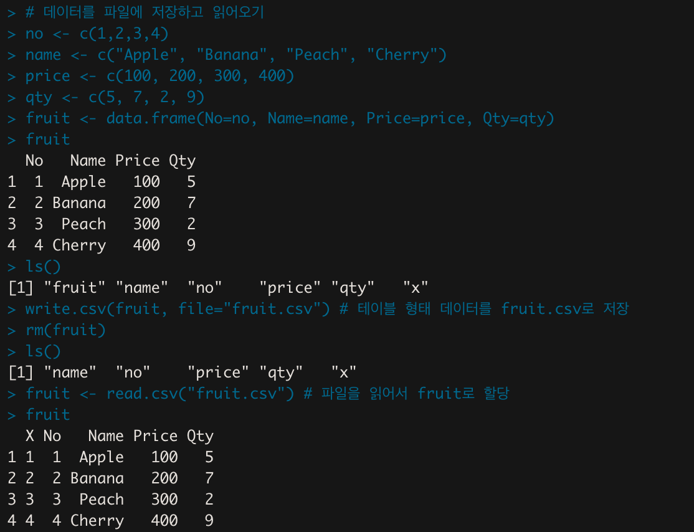
    
    - `c()` : 벡터로 만들어주는 함수
- `sink(”파일이름")` : 작업한 내용을 파일로 저장, 해당 파일 생성 이후에 작업하는 결과가 해당 파일에 저장된다.
- `sink()` : sink 설정 해제
    
    ```r
    > sink("output.txt") # output.txt 라는 이름의 빈 텍스트 파일 생성
    > cat("I love you") # I love you가 output.txt에 저장됨
    > sink() # sink 설정 해제
    ```
    
    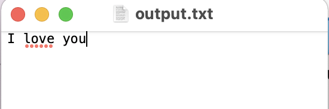
    
- `scan("파일이름")` : 파일을 읽어온다.
    - 해당 파일에 문자가 포함된 경우 `scan("파일이름", what="")` what="" 라는 옵션이 필요하다.
    
    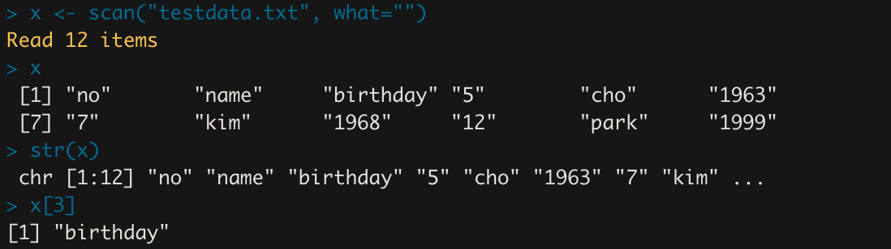
    
- `read.table("파일이름", header=T)` : 테이블 형태로 읽어온다.(헤더가 있는 상태)
    
    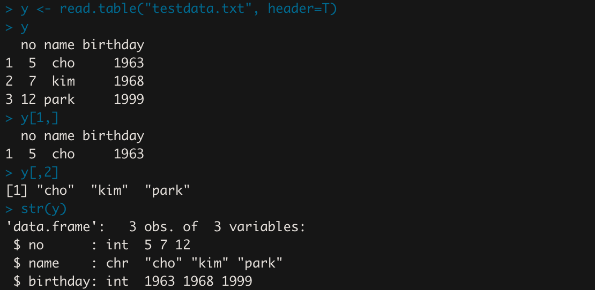
    
    - `y[1,]` : 1행을 가져온다.
    - `y[,2]` : 2열을 가져온다.

### 데이터 타입

<aside>
💡 **범주형 데이터**는 ‘A’, ‘B’, ‘C’와 같이 종류를 표시하는 데이터를 말한다.

</aside>

### 데이터의 종류

- `범주형 데이터(Categorical data)` : 데이터가 사전에 정해진 특정 유형으로만 분류되는 경우의 데이터
    - 명목형(Nominal): 값들간의 크기 비교가 불가능한 경우
        - 예) 정치 성향을 좌, 우파로 나누는 경우
    - 순서형(Ordinal): 값에 순서를 둘 수 있는 경우
        - 예) 대, 중, 소형의 물건
- `수치형 데이터(Numerical data)` : 숫자로 되어 있는 경우의 데이터
    - 이산형(Discrete): 이산적인 값을 가지는 데이터
        - 예) 한 달간 사고 횟수, 년간 출산수
    - 연속형(Continuous): 연속적인 값을 가지는 데이터
        - 예) 키, 체중, 혈압 등