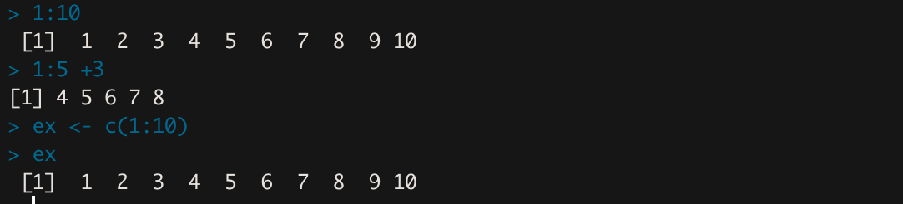
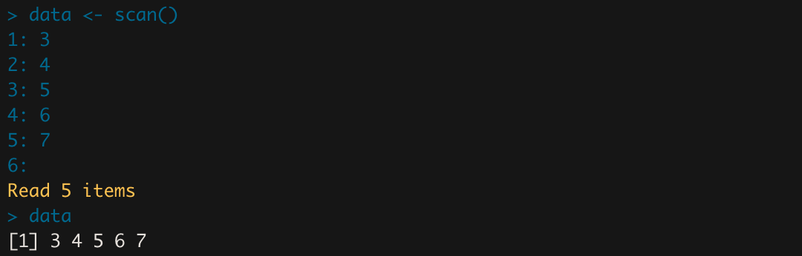

# 데이터 처리

## 벡터 데이터

### 벡터 데이터를 만드는 방법



기본적인 벡터 데이터 만들기

### 벡터 데이터의 생성 및 기본 함수의 사용

```r
# 기본적인 벡터 만들고 변수에 할당하기
> x <- c(1,2,3,4,5)
> x
[1] 1 2 3 4 5
> y <- c(5:1)
> y
[1] 5 4 3 2 1

> mean(x) # 평균
[1] 3

> range(x) # 범위
[1] 1 5

> sort(x, decreasing=TRUE) # 내림차순 정렬
[1] 5 4 3 2 1

> length(x) # 길이
[1] 5

> x[2] # x의 2번째 인덱스값(R은 인덱스가 1부터 시작함)
[1] 2

> xx <- x[5] # 변수 xx에 x[5]에 해당하는 값 할당
> xx
[1] 5

> x[3] <- 8 # x[3]에 8이라는 값 할당
> x
[1] 1 2 8 4 5

> (x[-3]) # x[3]의 값을 제외하고 출력
[1] 1 2 4 5

> xa <- x[-3] # x[3]의 값을 제외한 벡터를 변수 xa에 할당
> xa
[1] 1 2 4 5

> x[2:4] # x[2] ~ x[4] 범위의 값 출력
[1] 2 8 4

> z <= replace(x, c(2,5), c(12,13)) # 2,5번째 값을 12와 13으로 각각 바꿈
> z
[1] 1 12 8 4 13

> w <- append(x,y) # x,y를 연결해서 변수 w에 할당
> w
[1] 1 2 8 4 5 5 4 3 2 1
```

- `rep(x:y)` : 일정한 데이터를 반복하는 함수
    - `rep(x:y, times=z)` : x부터 y까지 z번 반복
    - `rep(x:y, times=z, len=n)` : 길이 n으로 제한하고 반복
    - `rep(x:y, each=z)` : x부터 y까지 각각 동일한 횟수로 반복
    
    ```r
    > rep(1:3, times=3)
    [1] 1 2 3 1 2 3 1 2 3
    > rep)1:3, times=3, len=7)
    [1] 1 2 3 1 2 3 1
    > rep(1:3, each=3)
    [1] 1 1 1 2 2 2 3 3 3
    ```
    
- `seq(from=x, to=y)` : 일정한 구조/순차 데이터 생성
    - `seq(from=x, to=y, by=z)` : x에서 y까지 z 단위씩 커짐
    - `seq(x, y, len=z)` : x~y까지의 수를 z개의 숫자로 등간격 구성
    
    ```r
    > seq(from=1, to=3)
    [1] 1 2 3
    > seq(1:3)
    [1] 1 2 3
    > seq(1,3)
    [1] 1 2 3
    
    > seq(from=1, to=3, by=0.5)
    [1] 1.0 1.5 2.0 2.5 3.0
    
    > seq(1, 10, len=5)
    [1] 1.00  3.25  5.50  7.75 10.00
    ```
    
- `scan()` : (숫자) 인자를 직접 입력받는 함수
    - 입력을 끝내고 싶다면 마지막 줄에 아무것도 입력하지 않고 엔터
    - 문자 데이터를 입력하고 싶으면 `scan(what="")` 옵션을 주면된다.
    
    
    

### 백터 데이터의 조작 및 생성 방법의 응용

```r
> c(1,2) + c(5,4) # 각각 더한다. (1+5, 2+4)
[1] 6 6

> c(1,2,3)+1 # (1+1, 2+1, 3+1)
[1] 2 3 4

> x <- c(1,2,8,4,5)
> x+1 # 모든 값에 각각 +1씩 더해줌
[1] 2 3 9 5 6

> vector <- -5:5 # -5~5까지의 값을 벡터로
> vector
[1] -5 -4 -3 -2 -1 0 1 2 3 4 5

> vector2 <- c(-5, 5) # -5와 5 값을 벡터로
> vector2
[1] -5 5

> vector3 <- c(-5:5) # -5~5까지의 값을 벡터
> vector3
[1] -5 -4 -3 -2 -1 0 1 2 3 4 5

> vector4 <- seq(from=-5, to=5, by=1) # -5~5를 1 간격으로
> vector4
[1] -5 -4 -3 -2 -1 0 1 2 3 4 5

> vector5 <- seq(from=-5, to=5, by=0.5) # -5~5를 0.5 간격으로
> vector5
[1] -5.0 -4.5 -4.0 -3.5 -3.0 -2.5 -2.0 
[8] -1.5 -1.0 -0.5  0.0  0.5  1.0  1.5
[15]  2.0  2.5  3.0  3.5  4.0  4.5  5.0

> vector6 <- seq(15) # 1~15
> vector6
[1] 1 2 3 4 5 6 7 8 9 10 11 12 13 14 15
```

### 벡터 데이터의 집합 연산

```r
> x <- c(1,2,3)
> y <- c(3,5,6)

> union(x,y) # 합집합
[1] 1 2 3 5 6

> intersect(x,y) # 교집합
[1] 3

> setdiff(x,y) # x의 y에 대한 차집합
[1] 1 2

> is.element(2, x) # 2가 x에 속하는지 확인
[1] TRUE

> x <- c(sort(sample(1:99, 9))) # 9개를 임의로 뽑아서 오름차순으로 정렬하여 x에 할당
> x
[1] 32 36 39 47 51 57 68 80 87
```

### 문자로 구성된 벡터 데이터의 연산

```r
> x <- c("A", "B", "A", "D", "C", "F", "C")
> x
[1] "A" "B" "A" "D" "C" "F" "C"

> unique(x) # 집합으로 만듬(중복 원소 제거)
[1] "A" "B" "D" "C" "F"

> match(x, c("A")) # 같으면 1, 같지 않으면 NA
[1] 1 NA 1 NA NA NA NA

> k <- paste(x[1],x[3]) # x[1]값과 x[3]값을 공백을 사이에 두고 문자열로 만들어줌
> k
[1] "A A"

> paste(x, collapse="%") # 원소 간에 %로 구별해서 문자열로 만듬
[1] "A%B%A%D%C%F%C"

> paste(x, collapse='') # 공백없이 붙여서 문자열로 만듬
[1] "ABADCFC"

> m <- paste(x, collapse='')
> m
[1] "ABADCFC"

> substring(m, 2:5) # m문자열에서 2번째 이후, 3번째 이후 ~~ 출력 
[1] "BADCFC" "ADCFC"  "DCFC"   "CFC"

> x <- c("Hongik", "University", "Computer", "Science", "Communication")
> x
[1] "Hongik" "University" "Computer" "Science" "Communication"
> grep("Co", x) # "Co"로 시작하는 문자열의 위치(인덱스)
[1] 3 5
> grep("(om)", x) # "om"을 포함하는 문자열의 위치
[1] 3 5
```

### 논리형 데이터로 구성된 벡터의 연산

```r
> x <- runif(5) # 0과 1 사이의 난수 5개 생성
> x
[1] 0.36711632 0.52049735 0.03177941 0.48632599 0.51174490
> (0.4 <= x) & (x <= 0.7)
[1] FALSE  TRUE FALSE  TRUE  TRUE

> any(x > 0.7) # 하나라도 만족하는지
[1] FALSE
> all(x < 0.9) # 모두 만족하는지
[1] TRUE

> is.vector(x) # 벡터 타입인지
[1] TRUE
> is.factor(x) # 요인 타입인지
[1] FALSE

> x <- rnorm(5) # 평균이 0, 표준편차가 1인 표준정규분포를 따르는 숫자 5개 만들어 할당
> x
[1]  0.09429791  1.00406728  1.12601034 -1.42797615 -2.32888805
```

---

## 행렬 데이터

### 숫자로 구성된 행렬 데이터의 선언 및 연산

```r
> array1 <- c(1,2,3)
> array2 <- c(4,5,6)
> array3 <- c(7,8,9)

# 행 관점으로 행렬 생성
> mat1 <- rbind(array1, array2, array3)
> mat1       
				[,1] [,2] [,3]
array1    1    2    3
array2    4    5    6
array3

# 열 관점으로 행렬 생성
> mat2 <- cbind(array1, array2, array3)
> mat2
     array1 array2 array3
[1,]      1      4      7
[2,]      2      5      8
[3,]      3      6      9

# 각 행의 max값
> apply(mat1, 1, max)
array1 array2 array3      
3      6      9 
# 각 열의 max값
> apply(mat1, 2, max)
[1] 7 8 9

# 열 이름 지정하기
> colnames(mat1) <- c("A", "B", "C")
> mat1       
			 A B C
array1 1 2 3
array2 4 5 6
array3 7 8 9

> k <- c(1:9)
# 열 단위로 채우면서 행렬 생성
> temp <- matrix(k, nrow=3)
> temp
     [,1] [,2] [,3]
[1,]    1    4    7
[2,]    2    5    8
[3,]    3    6    9

# 모든 값 2배로 만들기
> temp *2
     [,1] [,2] [,3]
[1,]    2    8   14
[2,]    4   10   16
[3,]    6   12   18

# 행렬 곱은 %*%
# 1행 *2, 2행 *4, 3행 *6
> temp * c(2,4,6)
     [,1] [,2] [,3]
[1,]    2    8   14
[2,]    8   20   32
[3,]   18   36   54

# 숫자로 구성된 행렬 데이터 선언
> x <- matrix(1:12, nrow=3, dimnames=list(c("R1", "R2", "R3"), c("C1", "C2", "C3", "C4")))
> x
   C1 C2 C3 C4
R1  1  4  7 10
R2  2  5  8 11
R3  3  6  9 12

> x[7] # 7번째 인덱스(열부터 채워짐)
[1] 7
> x[1,] # 1행
C1 C2 C3 C4
 1  4  7 10
```r
> array1 <- c(1,2,3)
> array2 <- c(4,5,6)
> array3 <- c(7,8,9)

# 행 관점으로 행렬 생성
> mat1 <- rbind(array1, array2, array3)
> mat1       
				[,1] [,2] [,3]
array1    1    2    3
array2    4    5    6
array3

# 열 관점으로 행렬 생성
> mat2 <- cbind(array1, array2, array3)
> mat2
     array1 array2 array3
[1,]      1      4      7
[2,]      2      5      8
[3,]      3      6      9

# 각 행의 max값
> apply(mat1, 1, max)
array1 array2 array3      
3      6      9 
# 각 열의 max값
> apply(mat1, 2, max)
[1] 7 8 9

# 열 이름 지정하기
> colnames(mat1) <- c("A", "B", "C")
> mat1       
			 A B C
array1 1 2 3
array2 4 5 6
array3 7 8 9

> k <- c(1:9)
# 열 단위로 채우면서 행렬 생성
> temp <- matrix(k, nrow=3)
> temp
     [,1] [,2] [,3]
[1,]    1    4    7
[2,]    2    5    8
[3,]    3    6    9

# 모든 값 2배로 만들기
> temp *2
     [,1] [,2] [,3]
[1,]    2    8   14
[2,]    4   10   16
[3,]    6   12   18

# 행렬 곱은 %*%
# 1행 *2, 2행 *4, 3행 *6
> temp * c(2,4,6)
     [,1] [,2] [,3]
[1,]    2    8   14
[2,]    8   20   32
[3,]   18   36   54

# 숫자로 구성된 행렬 데이터 선언
> x <- matrix(1:12, nrow=3, dimnames=list(c("R1", "R2", "R3"), c("C1", "C2", "C3", "C4")))
> x
   C1 C2 C3 C4
R1  1  4  7 10
R2  2  5  8 11
R3  3  6  9 12

> x[7] # 7번째 인덱스(열부터 채워짐)
[1] 7

> x[1,] # 1행
C1 C2 C3 C4
 1  4  7 10

> x[,2:4] # 2열~4열
   C2 C3 C4
R1  4  7 10
R2  5  8 11
R3  6  9 12

> x[, -2] # 2열을 제외하고
   C1 C3 C4
R1  1  7 10
R2  2  8 11
R3  3  9 12

> parData1 <- x[1,]
> parData1
C1 C2 C3 C4
 1  4  7 10 

> parData2 <- x[3,]
> parData2
C1 C2 C3 C4  
 3  6  9 12 

# 행으로 결합
> parData <- rbind(parData1, parData2)
> parData
         C1 C2 C3 C4
parData1  1  4  7 10
parData2  3  6  9 12

> x
   C1 C2 C3 C4
R1  1  4  7 10
R2  2  5  8 11
R3  3  6  9 12

> mean(x[2,]) # 2행의 평균
[1] 6.5

> apply(x, 1, sum) # 각 행의 합계
R1 R2 R3
22 26 30 

> apply(x, 1, mean) # 각 행의 평균
R1  R2  R3
5.5 6.5 7.5 
> apply(x, 2, sum) # 각 열의 합계
C1 C2 C3 C4  
6 15 24 33 

> colSums(x) # 각 열의 합계
C1 C2 C3 C4 
 6 15 24 33 
> rowSums(x) # 각 행의 합계
R1 R2 R3 
22 26 30
```

### 문자로 구성된 행렬 데이터의 선언

```r
> chars <- c("A","B","C","D","E","F","G","H","I","J")
> Cmat1 <- matrix(chars)
> Cmat1 # 10행 1열의 행렬 구성
		[,1] 
[1,] "A"  
[2,] "B"  
[3,] "C"  
[4,] "D"  
[5,] "E"  
[6,] "F"  
[7,] "G"  
[8,] "H"  
[9,] "I" 
[10,] "J"

> Cmat2 <- matrix(chars, nrow=5) # 5행으로 행렬 구성
> Cmat2     
		[,1] [,2]
[1,] "A"  "F" 
[2,] "B"  "G" 
[3,] "C"  "H" 
[4,] "D"  "I" 
[5,] "E"  "J"

> Cmat3 <- matrix(chars, ncol=5) # 5열로 행렬 구성
> Cmat3     
		[,1] [,2] [,3] [,4] [,5]
[1,] "A"  "C"  "E"  "G"  "I" 
[2,] "B"  "D"  "F"  "H"  "J"
```

---
## 데이터프레임 데이터

### data.frame 명령어의 사용법

```r
> no <- c(1,2,3,4)
> name <- c("Minho","Juno","Mandy","Paul")
> ages <- c(52, 45, 32, 50)
> sex <- c("M", "M","F","M")
> Insa <- data.frame(No=no, Name=name, Age=ages, Sex=sex)
> Insa
	No Name Age Sex
1	 1 Minho 52  M 
2	 2 Juno  45  M
3  3 Mandy 32  F
4  4 Paul  50  M

> Insa[1,] # 1행
	No Name Age Sex
1	 1 Minho 52  M

> Insa[, 2:4] # 2열~4열
	Name Age Sex
1	Minho 52  M 
2	Juno  45  M
3 Mandy 32  F
4 Paul  50  M

> Insa [, -3] # 3열 제외
	No Name Sex
1	 1 Minho M 
2	 2 Juno  M
3  3 Mandy F
4  4 Paul  M
```

---

## 배열 데이터

### array, mean 명령어의 사용법

```r
> x <- array(1:24, dim = c(2,4,3)) # 2x4 행렬 3개
> x
, , 1
     [,1] [,2] [,3] [,4]
[1,]    1    3    5    7
[2,]    2    4    6    8

, , 2
     [,1] [,2] [,3] [,4]
[1,]    9   11   13   15
[2,]   10   12   14   16

, , 3
     [,1] [,2] [,3] [,4]
[1,]   17   19   21   23
[2,]   18   20   22   24

# 각 행렬의 1행을 뽑아서 열로 구성
> x[1,,]
     [,1] [,2] [,3]
[1,]    1    9   17
[2,]    3   11   19
[3,]    5   13   21
[4,]    7   15   23

# 각 행렬의 1열을 뽑아서 열로 구성
> x[,1,]
     [,1] [,2] [,3]
[1,]    1    9   17
[2,]    2   10   18

# 각 행렬의 1행 3열의 원소를 뽑음
> x[1,3,]
[1]  5 13 21

# 3번 행렬의 2행 4열에 해당하는 원소
> x[2,4,3]
[1] 24

# x[1,,] 행렬의 모든 원소의 평균
> mean(x[1,,])
[1] 12

# x[,2,] 행렬의 모든 원소의 평균
> mean(x[,2,])
[1] 11.5

# x[1,2,]의 모든 원소의 평균
> mean(x[1,2,])
[1] 11
```

---

## 리스트 데이터

### list 명령어의 사용법

```r
> ListData2 <- c("Minho", c(12,23,34)) # 모두 문자열로 변환되고 리스트형 데이터 생성
> ListData2
[1] "Minho" "12" "23" "34"
> ListData2[2]
[1] "12"
> ListData2[3]
[1] "23"

# 리스트형 데이터 생성
> ListData3 <- list(name="Minho", age=56, sex="Male")
> ListData3 # 리스트 형 데이터는 (키, 값)의 형태
$name
[1] "Minho"
$age
[1] 56
$sex
[1] "Male"

> ListData3$name
[1] "Minho"

> ListData3[[1]] # 첫번째 원소의 값을 추출
[1] "Minho"

> ListData3[1] # 첫번째 원소의 정보 (키, 값)
$name
[1] "Minho"
```