# 데이터 조작
## rbind, cbind 함수와 행렬 데이터의 사용

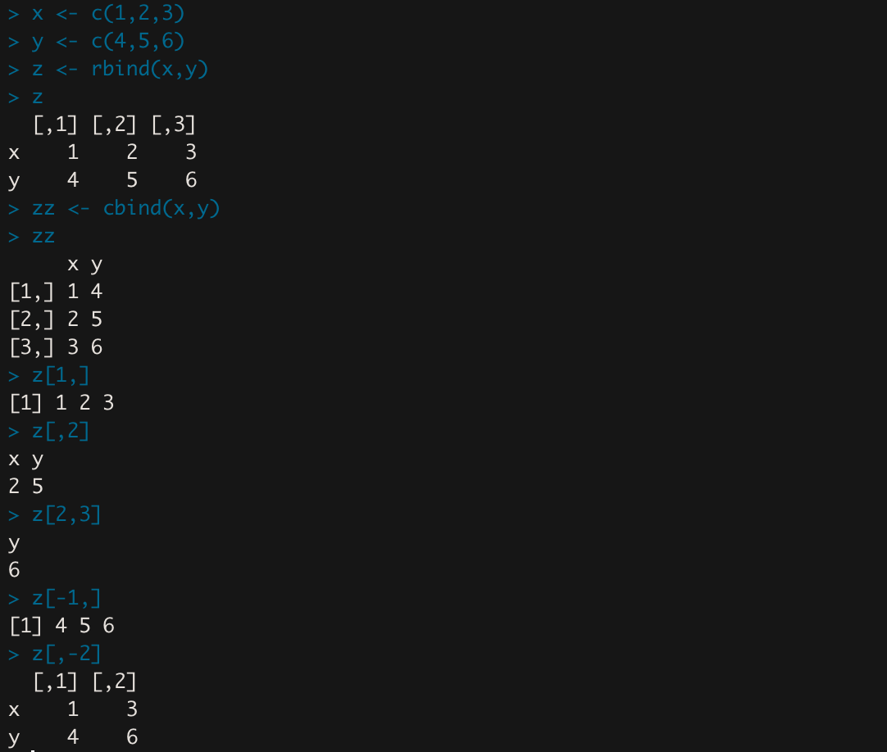

- `rbind()` : 행 묶음으로 행렬 구성
- `cbind()` : 열 묶음으로 행렬 구성
- `x[행, 열]`
    - `x[1, ]` : x의 1행
    - `x[, 2]` : x의 2열
    - `x[2, 3]` : x의 2행 3열 값
    - `x[-1,]` : 1행 제외
    - `x[,-1]` : 1열 제외

### 행렬 원소 연산

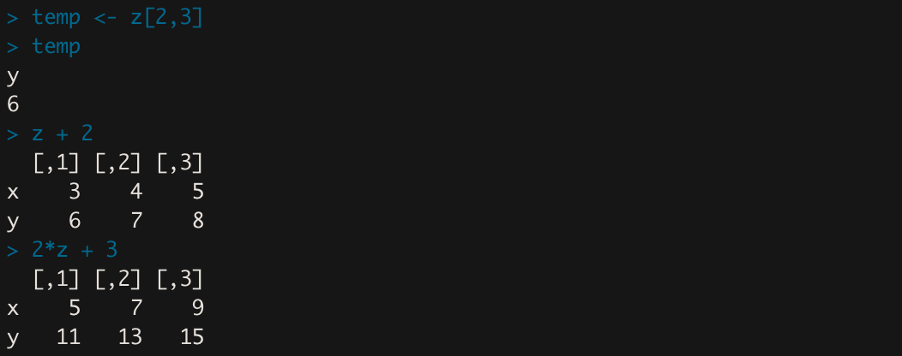

모든 원소에 대해서 연산이 실행된다.

### 행렬끼리 연산

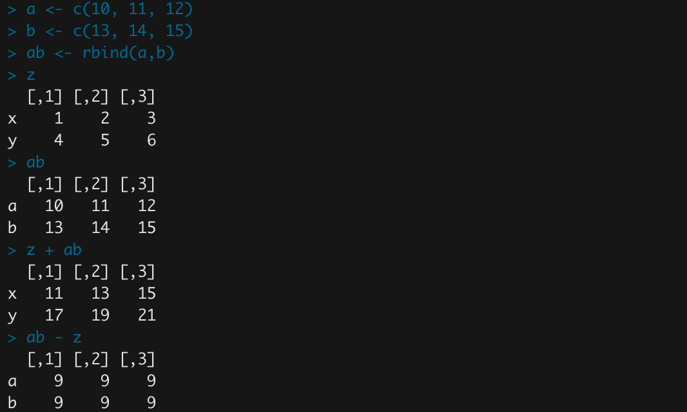

## apply 계열 함수

`apply(객체, 1, 연산함수)` : 행 단위로 연산

`apply(객체, 2, 연산함수)` : 열 단위로 연산

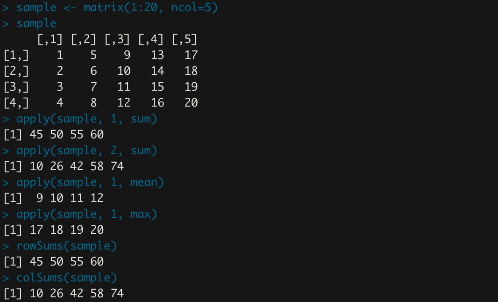

- 행의 합: `apply(sample, 1, sum)` == `rowSums(sample)`
- 열의 합: `apply(sample, 2, sum)` == `colSums(sample)`

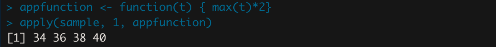

- `appfunction()` :max값 *2를 반환하는 함수 정의
    
    → `apply()` 함수는 사용자 정의 함수와 연계해서 사용 가능하다.
    

### summary, order, sample 함수

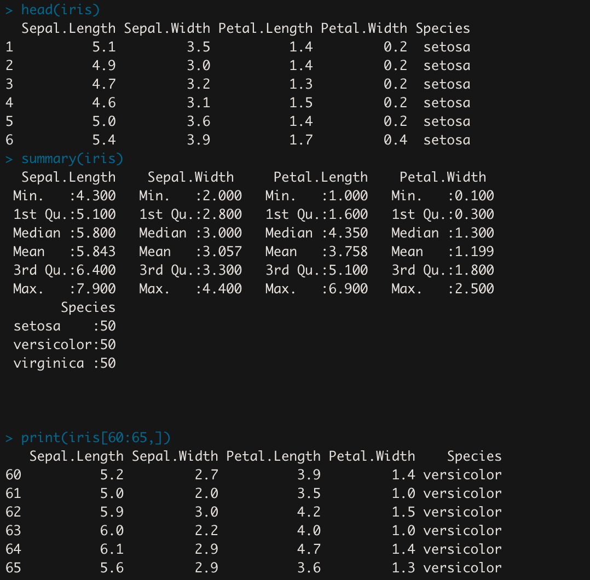

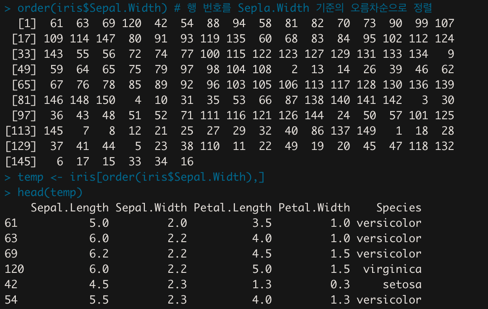

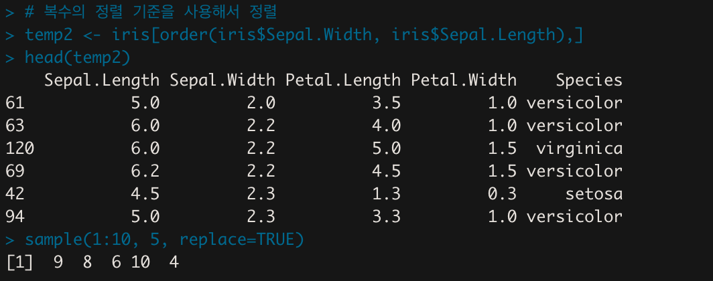

- `sample(1:10, 5, replace=TRUE)` : 1~10까지 5개의 수를 무작위로 뽑음
    - `replace=TRUE` 옵션을 주면 한번 추출한 값을 기존 데이터에 다시 넣고 뽑는다.(복원 추출)

### split, subset, with, merge 함수

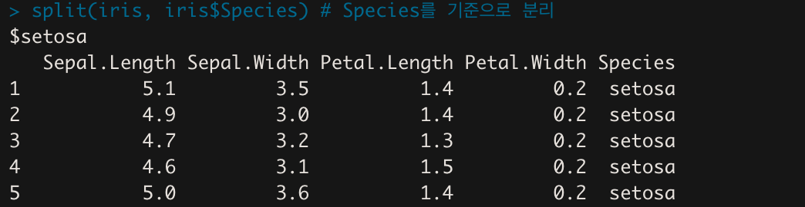

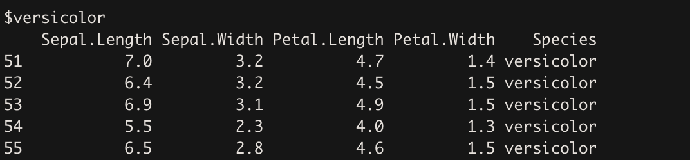

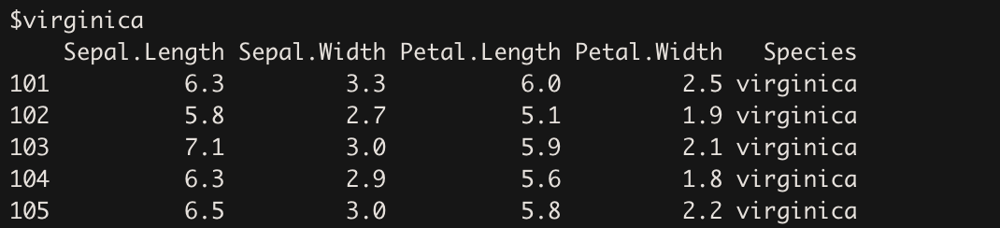

중간 값들은 중략함.

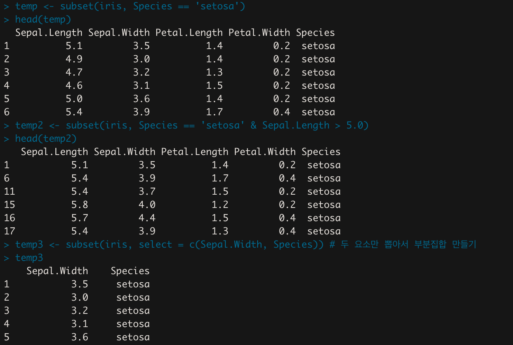

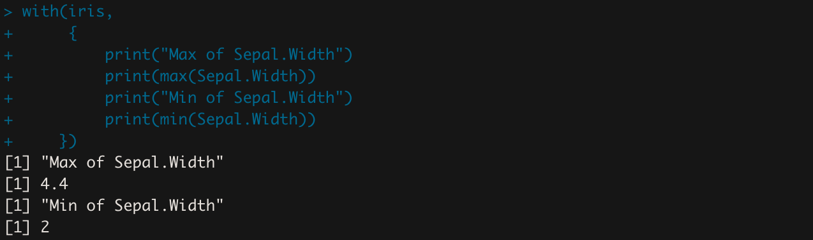

- `with` 이후에는 iris를 명시하지 않아도 된다.
    - `max(iris$Sepal.width)`가 아닌 `max(Sepal.width)`

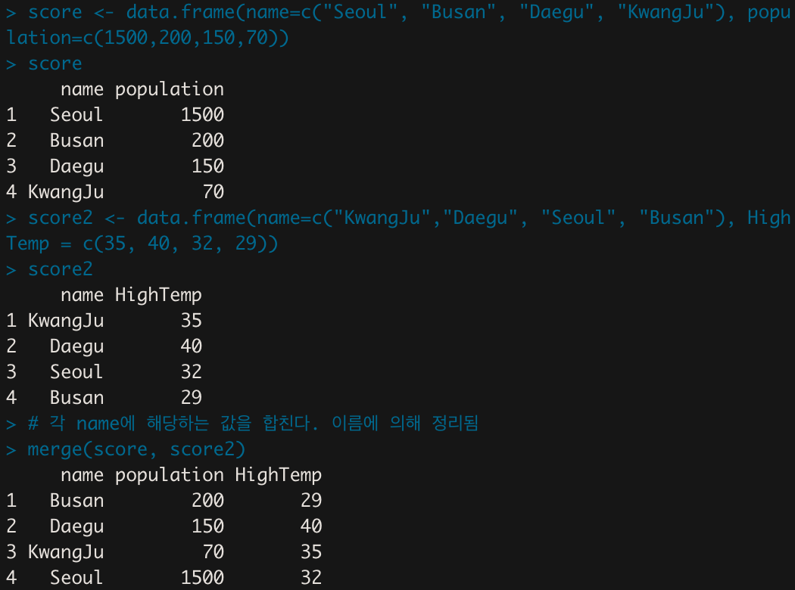

### which, aggregate 함수

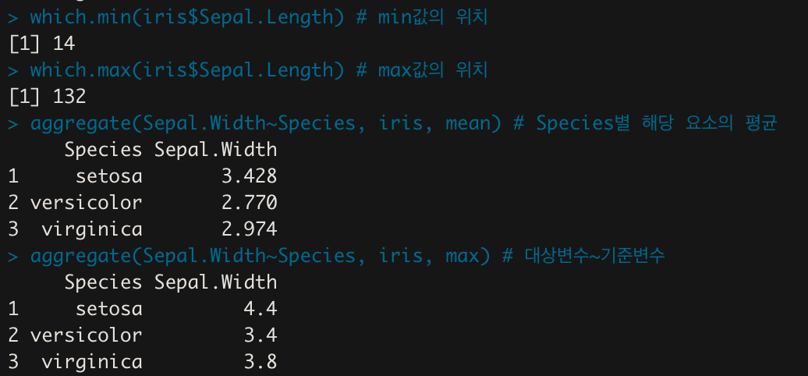

- `aggregate(Sepal.Width~Species, iris, max)` : Species별 Sepal.Width의 max값